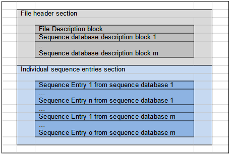

PEFF: A Common Sequence Database Format for Proteomics
======================================================

> **Note**
> 
> This document provides information to the proteomics community about a common sequence database format for proteomics. Distribution is unlimited
> 
> Version 1.0 FINAL

## Abstract

The Human Proteome Organisation (HUPO) Proteomics Standards Initiative
(PSI) defines community standards for data representation in proteomics
to facilitate data comparison, exchange and verification. This document
presents a unified format for protein and nucleotide sequence databases
to be used by sequence search engines and other associated tools
(spectral library search tools, sequence alignment software, data
repositories, etc.). This format enables consistent extraction, display
and processing of information such as protein/nucleotide sequence
database entry identifier, description, taxonomy, etc. across software
platforms. It also allows the representation of structural annotations
such as post-translational modifications, mutations and other processing
events. The proposed format has the form of a flat file that extends the
formalism of the individual sequence entries as presented in a FASTA
format and that includes a header of meta-data to describe relevant
information about the database(s) from which the sequence has been
obtained (i.e., name, version, etc.). The format is named PEFF (PSI
Extended FASTA Format). Sequence database providers are encouraged to
generate this format as part of their release policy or to provide
appropriate converters that can be incorporated into processing tools.
Further detailed information, including any updates to this document,
examples, and validators, is available at [http://www.psidev.info/peff](http://www.psidev.info/peff).

## Contents

- [PEFF: A Common Sequence Database Format for Proteomics](#peff-a-common-sequence-database-format-for-proteomics)
  - [Abstract](#abstract)
  - [Contents](#contents)
  - [Introduction](#introduction)
    - [Description of the need](#description-of-the-need)
    - [Requirements](#requirements)
    - [Issues to be addressed](#issues-to-be-addressed)
  - [Notational Conventions](#notational-conventions)
  - [The Format Implementation](#the-format-implementation)
    - [The documentation](#the-documentation)
    - [Relationship to other specifications](#relationship-to-other-specifications)
    - [The common sequence database format description](#the-common-sequence-database-format-description)
      - [PEFF file section 1: The file header section](#peff-file-section-1-the-file-header-section)
        - [Format of the file header section](#format-of-the-file-header-section)
        - [Defining custom keys in the sequence database description block for use in the sequence entries section](#defining-custom-keys-in-the-sequence-database-description-block-for-use-in-the-sequence-entries-section)
      - [Section 2: The individual sequence entries section](#section-2-the-individual-sequence-entries-section)
        - [Format of the individual sequence entries](#format-of-the-individual-sequence-entries)
        - [Generic illustration:](#generic-illustration)
        - [Real example](#real-example)
      - [Recommendations on and order of the keys in a description line](#recommendations-on-and-order-of-the-keys-in-a-description-line)
      - [Definition of `OptionalTag` elements](#definition-of-optionaltag-elements)
      - [Definition of complex header keys](#definition-of-complex-header-keys)
      - [Variant header key](#variant-header-key)
      - [VariantSimple header key](#variantsimple-header-key)
      - [VariantComplex header key](#variantcomplex-header-key)
      - [ModResUnimod header key](#modresunimod-header-key)
      - [ModResPsi header key](#modrespsi-header-key)
      - [`ModRes` header key](#modres-header-key)
      - [`Processed` header key](#processed-header-key)
    - [Advanced features for proteoforms and other combinations of annotations](#advanced-features-for-proteoforms-and-other-combinations-of-annotations)
      - [Long form recommendation for Proteoforms: The `ProteoformDb=true` key-value pair](#long-form-recommendation-for-proteoforms-the-proteoformdbtrue-key-value-pair)
      - [Annotation identifiers enabling compact form recommendation for Proteoforms: The `HasAnnotationIdentifiers=true` key-value pair](#annotation-identifiers-enabling-compact-form-recommendation-for-proteoforms-the-hasannotationidentifierstrue-key-value-pair)
    - [Additional considerations](#additional-considerations)
      - [Representation of splicing variants](#representation-of-splicing-variants)
      - [Representation of processed sequences](#representation-of-processed-sequences)
      - [File extension](#file-extension)
      - [PEFF File Validation](#peff-file-validation)
      - [PEFF Reference Implementation](#peff-reference-implementation)
  - [Authors Information](#authors-information)
  - [Contributors](#contributors)
  - [Intellectual Property Statement](#intellectual-property-statement)
  - [Copyright Notice](#copyright-notice)
  - [Glossary](#glossary)
    - [Key](#key)
    - [Item](#item)
    - [Component](#component)
    - [Tag / OptionalTag](#tag--optionaltag)
  - [References](#references)


## Introduction

### Description of the need

One of the main goals of proteomics is to identify and quantify proteins
in complex biological samples. This is achieved using mass spectrometry
(MS) as a major analytical tool and sequence search engines as the
bioinformatics interpretation tool. Sequence search engines aim at
matching experimental MS spectra with protein or peptide sequences from
a protein or nucleotide sequence database. Thousands of copies of
sequence databases are searched by so called sequence search algorithms
in proteomics labs all over the world. These algorithms regularly need
to download the databases in the available formats; then they extract
information including an identifier, taxonomy, description and sometimes
other information such as alternative splicing variants, sequence
processing leading to active forms and post-translational modifications
(PTMs) in addition to the sequence itself. Most of the software convert
the original format into a vendor-specific format to process the data.
Currently available sequence databases are made available in FASTA
format [^PEARSON1] ([http://en.wikipedia.org/wiki/FASTA_format](http://en.wikipedia.org/wiki/FASTA_format),
[http://www.ncbi.nlm.nih.gov/BLAST/fasta.shtml](http://www.ncbi.nlm.nih.gov/BLAST/fasta.shtml)) or in other native
formats (UniProtKB/Swiss-Prot and UniProtKB/TrEMBL in .dat or even XML
for instance [^THE_UNIPROT_CONSORTIUM1] [^APWEILER1]). For the same
database, the information might be richer or poorer according to the
format. For instance, the current FASTA format does not generally store
information such as splicing forms, mutations or PTMs. To access
information about these, one needs to choose another format, for
instance a richer XML format, or for UniProtKB the native .dat format
([http://www.expasy.org/sprot/userman.html](http://www.expasy.org/sprot/userman.html)). Yet, these files tend to
be huge with vast amounts of information that is not needed by search
engines.

MS-based peptide identification software tools deliver, in their
graphical interfaces or their export formats, protein and peptide hits
with information such as a protein accession code, sequence coverage,
matching score, taxonomy and description. The same entry identified by
different tools is not necessarily displayed in a unique manner, which
renders it difficult, if not impossible, to map results between the
tools. One reason for this is that these tools do not "parse" and
interpret the database content in a consistent manner. In order to
create a standardized manner to represent a protein in a search engine
result (entry identifier, description, taxonomy, etc.), and to enable a
consistent link to a protein from third party software, we are proposing
a unified format for sequence databases that can be interpreted in a
uniform manner by all sequence search software and other associated
tools. Converters generated by the database providers or elsewhere have
to be made available and maintained for the generation and parsing of
these databases.

There is also a need to be able to encode specific proteoforms for
top-down proteomics platforms. Proteoforms represent protein sequences
with a specific set of mass modifications at specific residues. The need
cannot be fulfilled with FASTA alone since there is no capacity for
encoding mass modifications on each sequence.

### Requirements

The main requirements to be fulfilled are:

- The format should allow more than one sequence database to be
  represented in one flat file.
- The format should require minimal changes to the existing parsers.
- The format should formalize the representation of all non-sequence
  associated information (identifiers, description, taxonomy, other
  structural or functional annotation data).
- The format should include meta-information about the database itself
  (name, version, type of content, etc.).
- Controlled vocabularies (CVs) should be pragmatically used for keys
  and values (i.e. database names, prefixes, entry keys such as
  NcbiTaxId, Protein/Gene Name).
- The format should be compatible with MIAPE guidelines
  (<http://www.psidev.info/miape>), for instance MIAPE MSI.
- The format should be able to support encoding proteoforms.

### Issues to be addressed

The main issues to be addressed by the format are:

- Definition lines in FASTA and other formats vary widely for no good
  reason. This causes problems for end users who want to use these files
  with protein identification tools. The creators of these tools are
  faced with a significant challenge to support all of these variations
  while consistently extracting the same information.
- The same database file is variably processed in different search
  engines. A given database entry can contain multiple identifiers,
  which can lead to variably interpreted identifiers, which renders
  difficult the mapping of identical entries in different tools (for
  instance the UniProtKB/Swiss-Prot AC: `P02768` vs. UniProtKB/Swiss-Prot
  ID: `ALBU_HUMAN`).
- The same protein (and therefore also primary sequence) in different
  databases can have very different identifiers (for example, `P02768` in
  UniProtKB/Swiss-Prot, `NX_P02768` in neXtProt,
  `gi|113576|sp|P02768.2|ALBU_HUMAN` in NCBI, and `ENSP00000295897` in
  Ensembl).
- The identifier information extracted from the FASTA formats is
  heterogeneous (`gi|113576` vs `113576` vs `sp|P02768` vs
  `gi|113576|sp|P02768.2|ALBU_HUMAN` etc.). The definition and format
  description of the identifier should come from the DB provider
  (documentation).
- Description and availability of taxonomy are also heterogeneous and
  need to be properly interpreted (Latin names, common names, NCBI
  TaxID).
- Choice of the description string (variations include full or partial
  description, including or not taxonomy information, alternative names,
  truncation at a defined number of characters, etc.).
- Version name or date of a specific database is often requested for
  traceability purposes and to allow reproducibility of results obtained
  from the use of a given database (number of entries, protein or gene
  names, descriptions, sequences, PTMs, etc. vary from one version to
  another).
- It should be possible to store more than one sequence database in a
  single flat file. As identifiers might be identical in two or more
  "merged" databases, a mechanism (using unique database prefixes)
  should be defined to avoid this.

## Notational Conventions

The key words "MUST", "MUST NOT", "REQUIRED", "SHALL", "SHALL NOT",
"SHOULD", "SHOULD NOT", "RECOMMENDED", "MAY", and "OPTIONAL" are to be
interpreted as described in RFC 2119 [^BRADNER1].

## The Format Implementation

### The documentation

The documentation of the format is divided into several documents and
files. These files are available from the main format description page
on the HUPO-PSI website (<http://www.psidev.info/peff>).

- Main specification document (this document)
- Controlled Vocabulary (CV). The CV keywords applicable for PEFF are in
  a branch of the PSI-MS CV
  (<https://github.com/HUPO-PSI/psi-ms-CV/blob/master/psi-ms.obo>),
  organized broadly as header keywords and individual entry keywords.
- Example files
- Reference to example implementations

### Relationship to other specifications

The specification described in this document is not being developed in
isolation; indeed, it is designed to be complementary to, and thus used
in conjunction with, several existing and emerging models. Related
specifications include the following:

1. *MIAPE-MSI* (<http://www.psidev.info/miape>) The "Minimum
    Information About a Proteomics Experiment: Mass Spectrometry
    Informatics" document identifies the minimum information required to
    report the use of a MS-based peptide and protein identification and
    characterization experiment. It is expected that the common sequence
    database format will be used to capture requirements specified in
    MIAPE-MSI. However, the format does not enforce MIAPE compliance
    itself and MAY be valid and useful without being fully MIAPE
    compliant. The only relevant MIAPE-MSI requirements regarding the
    database (aside from the fact that the database itself must be
    provided/identified) are the specification of a description, the
    version of the database, and the number of entries. All these
    concepts are supported in PEFF via the CV terms DbName,
    DbDescription, DbVersion, and NumberOfEntries.
2.  *mzIdentML* (<http://www.psidev.info/mzidentml>). The mzIdentML
    specification is developed by PSI as a standard to capture the
    output of search engines that assign mass spectra to protein or
    peptide sequences. For searches performed using a PEFF file, the
    downstream result in mzIdentML MUST encode a reference to the PEFF
    file used. This is already supported in mzIdentML.
3.  *mzTab* (<http://www.psidev.info/mztab>). The mzTab specification is
    developed by PSI as a standard to report proteomics and metabolomics
    results in a tab-delimited text file format. For searches performed
    using a PEFF file, the downstream result in mzTab will need to
    encode a reference to the PEFF file used. This is already supported
    in mzTab.

### The common sequence database format description

The format has the form of a text file with two sections, a file header
section and a section containing the individual sequence entries. The
two sections MUST be placed in the following order

- Section 1: The file header section.
- Section 2: The individual sequence entries section.

The characters allowed are the set of ASCII characters. A more
constrained set of characters can be defined for specific sections of
the file.

All lines in the file MUST end with `LF` (ASCII 10). A `CR` (ASCII 13) MAY
precede the `LF` and MUST be ignored by parsers.

Descriptors of the information are defined as keywords in a special
branch of the PSI-MS CV. The CV is available in OBO format at
<https://github.com/HUPO-PSI/psi-ms-CV/blob/master/psi-ms.obo>.

<figure>

<figcaption>Figure 1: Graphical representation of the PEFF file structure. In this
example, the file has *m* databases, database 1 has *n* entries,
database *m* has *o* entries</figcaption>
</figure>

#### PEFF file section 1: The file header section

The file header section contains all necessary information to describe
and reference the represented sequence database(s). This includes
information such as the database(s) name, source, version, size,
sequence type, etc. This meta-data section includes mandatory and
optional elements.

##### Format of the file header section

The file header section contains two types of information blocks: the
file description block and the sequence database description block. The
file header section MUST start with a file description block that MUST
be followed by at least one sequence database description block. All
lines in the file header section start with the character \#, followed
by a space (ASCII 32) character.

The format of the file description block is the following:

- The first line of this section is also the first line of the file. It
  MUST be:

```txt
\# PEFF N.N
```

where `N.N` represents the version number of the PEFF format, currently
1.0. Parsers SHOULD check this value and compare it to what they are
prepared to interpret;

- It MAY be followed by one or more general comment lines, which each
  have the following format:

```txt
\# GeneralComment=value
```

(where `value` is a string of text)

- The description block MUST end with the following line:

```txt
//
```

If there is a `GeneralComment`, it MUST not be empty.

The format of the sequence database description blocks is as follows:
- All lines of a sequence database description block contain one piece
  of information.
- Each piece of information MUST have the following format:

```txt
\# key=value
```

where the element `key` MUST be a keyword in the PSI-MS CV under the
"PEFF File Header Section term" branch. The format of the `value` is
defined for each key in the CV.
- The block MUST start with a sequence database line description and
  follow the following format:

```txt
\# DbName=value,
```
 (where *value* is the database name)

- The following five `key` elements MUST also be present: `Prefix`, `DbVersion`, `DbSource`, `NumberOfEntries`, `SequenceType`

If there is no obvious independent DbSource and DbVersion (for example, if the PEFF file is the only persistence of the information), then the writing software or author may be named as the source, and sort form of version numbering is recommended.

- Additional `key=values` pairs that are used in the sequence description
  blocks later in the document MUST be defined here using the
  SpecificKey key or another key defined in the CV and dedicated to this
  section (such as `IsProteoformDB` and `HasAnnotationIdentifier`).
- A sequence database information block MUST begin and end with the
  following separation line:

```
\# //
```

One or more sequence description blocks MUST be present. This is an
example of a PEFF header section:

```txt
\# PEFF 1.0
\# GeneralComment=This is a hand-crafted example comment
\# //
\# DbName=neXtProt-extract
\# Prefix=nxp
\# DbDescription=extract of neXtProt with manual modifications
\# GeneralComment=A GeneralComment specific to one database is also legal here
\# Decoy=false
\# DbVersion=2018-01-11
\# DbSource=http://www.nextprot.org
\# NumberOfEntries=62
\# SequenceType=AA
\# //
\# DbName=myDB
\# Prefix=my
\# DbDescription=FGF21 proteoforms from top-down experiment PXD123456
\# DbVersion=1.1
\# DbSource=PXD123456
\# NumberOfEntries=2
\# SequenceType=AA
\# ProteoformDB=true
\# HasAnnotationIdentifiers=true
\# //
```

Non mandatory key-value pairs in the file header section MAY be used to
add meta-data on the database description level (see section 3.3.2 and
3.3.3). They MUST be used to define keys that are not declared in the CV
and used in the individual sequence database entries. This might include
information such as protein function, ligands, links to experimental
evidences, other custom-defined information. They also can imply an
impact on the interpretation of the data provided in the individual
sequence database section (sequence and annotation).

##### Defining custom keys in the sequence database description block for use in the sequence entries section

Most of the keys found in each of the individual sequence entries
(described below in 3.3.3) are defined in the CV. However, it is
possible to define custom keys that MAY be used within custom pipelines.
The following rules SHOULD be applied:

- Do not create a custom key for a concept that is already in the CV. Check the CV carefully before creating a custom key
- For a PEFF file that will be exported publicly, concepts not already
  found in the PSI-MS CV should be proposed to [psidev-ms-dev@lists.sourceforge.net](mailto:psidev-ms-dev@lists.sourceforge.net) for inclusion in the CV so that others who need to reference the same concepts may do so using the same term.

However, for internal use, a new key MAY be defined in the file header
block:

```txt
\# CustomKeyDef=(defKey=value\|defKey=value\|defKey=value…)
```

Where there defKeys may be any combination of:
- KeyName Name of the custom key. CamelCase preferred
- Description Free text description of the custom key. Enclose in `""`
- ConceptCURIE CURIE from an external CV defining the concept behind
  this custom key
- RegExp Regular expression that can be used to parse this custom key.
  Enclose in `""`
- FieldNames Comma-separated list of names for the fields
- FieldTypes Comma-separated list of data types of the fields

FieldTypes should use the xsd basic types without the `xs:` prefix.
i.e.: `string`, `decimal`, `integer`, `boolean`, `date`, `time`. Additionally,
type `enumeration(string1\|string2\|string3\|etc.)` MAY also be used.

For example, a SecondaryStructure term MAY be defined in the header:

```txt
\# CustomKeyDef=(KeyName=SecondaryStructure\|Description="Secondary structure information"\|ConceptCURIE=BAO:0000014\|RegExp="(\[0-9\]+)\\\|(\[0-9\]+)\\\|(\[A-Za-z\]+:\[0-9\]+)?\\\|(.\*)\\\|?(.+)?"\|FieldNames=StartPosition,EndPosition,CURIE,Description,OptionalTag\|FieldTypes=integer,integer,string,string,string)
```

And then, if so defined, the term MAY be used in the sequence entry
description lines like this:

```
\SecondaryStructure=(617\|673\|ncithesaurus:C47937\|Helix)
```

#### Section 2: The individual sequence entries section

The individual sequence entries section contains the actual sequences,
their associated identifiers and additional descriptors. The format is
similar to a FASTA format. The informative elements appearing in the
FASTA description lines are structured in the below described format.
This section MUST immediately follow the file header section.

The format of each individual sequence entry is described below. The
individual sequence entries are placed in one single block of individual
sequence entries within a file. There MAY be empty lines between
individual sequence entries.

##### Format of the individual sequence entries

For each sequence entry:

- A sequence entry is composed of a description line and a sequence
  block line.

- The description line has the following structure:

```
\>Prefix:DbUniqueId \key=value \key=value...
```

- The header line MUST start with `*\>Prefix:DbUniqueId*` where `*Prefix*`
  is the database Prefix, as defined in the sequence database
  description block, of the corresponding sequence database. This is the
  unique mandatory information of the description line.

- Lines beginning with `;` (semicolon) are NOT permitted, although this
  was used in some early versions of FASTA (see
  https://en.wikipedia.org/wiki/FASTA_format)

- The description line MAY include optional information, separated by at
  least one space character, each of them described as `\key=value`
  pairs.

  - The order of the `\key=value` pairs is not prescribed, but see
    section 3.3.5 for general recommendations.

  - The element `key` MUST be a CV term unless it is defined in the PEFF
    file itself. The format of the `value` is defined for each key in
    the CV repository.

  - The same key MUST NOT appear twice in a description line

  - The `value` for each key can contain one item or a list of items. In
    the latter case, items are placed in parentheses: `...`
    There MAY be spaces between items.

```
Generic example: \key=(item1)(item2)
```

- In case `item` contains multiple components, the "\|" (pipe character)
  MUST be used as separator between components. The item therefore has
  the form

```
(component1\|component2)
```

- If an item contains paired parentheses, brackets, or braces, they
  SHOULD be rendered without an escape character and parsers MUST
  properly handle the case of embedded parentheses, e.g.
  `\ModRes=(380\|\|N-linked (GlcNAc...))`.

- If one of the components contains the `|` (pipe character), a `\`
  (backslash character), or an unpaired parenthesis character (e.g., "("
  without a corresponding ")" character) then it must be escaped by
  preceding it with a `\` (backslash character). For example, if an
  optionalTag component was `Abcg2\|meta\x10`, it should be written as
  `Abcg2\\|meta\\x10` in PEFF.

- Characters allowed for a key: Key: `[A-Za-z0-9\_]`; use CamelCase.

- Characters allowed for an item (if not complex) or a component of an
  item (unless the key is already controlled by a regular expression
  defined in the controlled vocabulary): `[A-Za-z0-9\_?]`

- The description line MUST contain only a single `\>Prefix:DbUniqueId \key=value` block per sequence. Some FASTA files such as the NCBI
  non-redundant (nr) database have been seen to have multiple headers
  per sequence separated by delimiter ASCII `001` (CTRL+A). It has been
  decided that PEFF does not support this and readers therefore do not
  need to support this. It is recommended either to split the entry and
  create one entry for each such differing header, or to make a
  selection of the most appropriate header for that PEFF file.

- The sequence block has the following structure:

- The sequence block contains the actual sequence, coded as one-letter
  code for both protein and nucleotide sequences. Allowed characters are
  described in the table below [^IUPAC1999][^UniProtKB user manual]:

- Amino acid table:


| 1 one-letter code | Amino acid name                                 |
|-----------------------|-----------------------------------------------------|
| `A`                     | Alanine                                             |
| `R`                     | Arginine                                            |
| `N`                     | Asparagine                                          |
| `D`                     | Aspartic acid                                       |
| `C`                     | Cysteine                                            |
| `Q`                     | Glutamine                                           |
| `E`                     | Glutamic acid                                       |
| `G`                     | Glycine                                             |
| `H`                     | Histidine                                           |
| `I`                     | Isoleucine                                          |
| `L`                     | Leucine                                             |
| `K`                     | Lysine                                              |
| `M`                     | Methionine                                          |
| `F`                     | Phenylalanine                                       |
| `P`                     | Proline                                             |
| `O`                     | Pyrrolysine                                         |
| `S`                     | Serine                                              |
| `U`                     | Selenocysteine                                      |
| `T`                     | Threonine                                           |
| `W`                     | Tryptophan                                          |
| `Y`                     | Tyrosine                                            |
| `V`                     | Valine                                              |
| `B`                     | Aspartic acid or Asparagine                         |
| `Z`                     | Glutamic acid or Glutamine                          |
| `X`                     | Any amino acid                                      |
| `J`                     | Leucine or Isoleucine                               |
| `*`                     | Sequence interruption (stop codon, unknown linkage) |

- Nucleotide table

| 1 one-letter code | Nucleotide name             |
|-----------------------|----------------------------------|
| `G`                     | Guanine                          |
| `A`                     | Adenine                          |
| `T`                     | Thymine                          |
| `C`                     | Cytosine                         |
| `U`                     | Uracil                           |
| `R`                     | `A` or `G`                           |
| `Y`                     | `C`, `T` or `U`                        |
| `K`                     | `G`, `T` or `U`                        |
| `M`                     | `A` or `C`                          |
| `S`                     | `C` or `G`                           |
| `W`                     | `A`, `T` or `U`                        |
| `B`                     | not `A `                           |
| `D`                     | not `C`                            |
| `H`                     | not `G`                            |
| `V`                     | neither `T` nor `U`                  |
| `N`                     | Any nucleotide                   |
| `-`                    | Sequence interruption (i.e. gap) |

- The sequence block MAY be a single long line with only a single line
  ending. We however suggest wrapping the sequences to 60-100 characters
  per line for better human readability.

- There MAY be blank lines in the individual sequence entries section,
  although this is discouraged.

##### Generic illustration:

```txt
\>Prefix:DbUniqueID1 \key=value \key=value
SEQUENCESEQUENCE
\>Prefix:DbUniqueID2 \key=value \key=value
SEQUENCESEQSEQUENCE
```

##### Real example

```txt
\>nxp:NX_Q06418-1 \PName=Tyrosine-protein kinase receptor TYRO3 isoform Iso 1 \GName=TYRO3 \NcbiTaxId=9606 \TaxName=Homo Sapiens \Length=890 \SV=135 \EV=357 \PE=1 \Processed=(1\|40\|PEFF:0001021\|signal peptide)(41\|890\|PEFF:0001020\|mature protein) \ModResPsi=(681\|MOD:00048\|O4'-phospho-L-tyrosine)(685\|MOD:00048\|O4'-phospho-L-tyrosine)(686\|MOD:00048\|O4'-phospho-L-tyrosine)(804\|MOD:00048\|O4'-phospho-L-tyrosine)(64\|MOD:00798\|half cystine)(117\|MOD:00798\|half cystine)(160\|MOD:00798\|half cystine)(203\|MOD:00798\|half cystine) \ModRes=(63\|\|N-linked(GlcNAc...)) (191\|\|N-linked (GlcNAc...))(230\|\|N-linked(GlcNAc...))(240\|\|N-linked (GlcNAc...))(293\|\|N-linked(GlcNAc...))(366\|\|N-linked (GlcNAc...))(380\|\|N-linked (GlcNAc...))\VariantSimple=(21\|L)(68\|R)(74\|M)(85\|K)(90\|H)(95\|G)(114\|G)(119\|E)(119\|L)(129\|R)(144\|K)(156\|S)(178\|M)(185\|S)(187\|L)(200\|I)(208\|P)(210\|D)(215\|H)(228\|S)(235\|R)(240\|I)(251\|S)(260\|L)(265\|D)(273\|G)(277\|L)(283\|Y)(290\|S)(299\|H)(302\|S)(302\|K)(303\|V)(306\|S)(311\|H)(314\|L)(331\|T)(333\|C)(333\|H)(346\|N)(348\|K)(351\|S)(352\|D)(353\|S)(371\|D)(392\|I)(396\|I)(399\|T)(416\|C)(433\|F)(445\|S)(452\|Q)(455\|Q)(455\|W)(468\|V)(470\|Q)(487\|K)(489\|K)(511\|M)(521\|S)(522\|Q)(523\|L)(533\|Q)(542\|S)(545\|G)(549\|G)(566\|F)(567\|G)(580\|L)(590\|N)(596\|R)(600\|I)(605\|L)(619\|Q)(623\|K)(635\|L)(638\|N)(647\|R)(648\|F)(659\|W)(669\|L)(675\|R)(690\|R)(705\|V)(717\|T)(719\|R)(723\|C)(723\|L)(728\|C)(734\|S)(750\|C)(756\|Q)(759\|D)(773\|S)(776\|L)(777\|A)(785\|K)(788\|S)(797\|F)(815\|V)(817\|D)(819\|M)(824\|G)(829\|N)(831\|T)(833\|N)(842\|D)(169\|I)(343\|K)(620\|T)(819\|Q)(848\|W)(875\|R)
MALRRSMGRPGLPPLPLPPPPRLGLLLAALASLLLPESAAAGLKLMGAPVKLTVSQGQPVKLNCSVEGMEEPDIQWVKDGAVVQNLDQLYIPVSEQHWIGFLSLKSVERSDAGRYWCQVEDGGETEISQPVWLTVEGVPFFTVEPKDLAVPPNAPFQLSCEAVGPPEPVTIVWWRGTTKIGGPAPSPSVLNVTGVTQSTMFSCEAHNLKGLASSRTATVHLQALPAAPFNITVTKLSSSNASVAWMPGADGRALLQSCTVQVTQAPGGWEVLAVVVPVPPFTCLLRDLVPATNYSLRVRCANALGPSPYADWVPFQTKGLAPASAPQNLHAIRTDSGLILEWEEVIPEAPLEGPLGPYKLSWVQDNGTQDELTVEGTRANLTGWDPQKDLIVRVCVSNAVGCGPWSQPLVVSSHDRAGQQGPPHSRTSWVPVVLGVLTALVTAAALALILLRKRRKETRFGQAFDSVMARGEPAVHFRAARSFNRERPERIEATLDSLGISDELKEKLEDVLIPEQQFTLGRMLGKGEFGSVREAQLKQEDGSFVKVAVKMLKADIIASSDIEEFLREAACMKEFDHPHVAKLVGVSLRSRAKGRLPIPMVILPFMKHGDLHAFLLASRIGENPFNLPLQTLIRFMVDIACGMEYLSSRNFIHRDLAARNCMLAEDMTVCVADFGLSRKIYSGDYYRQGCASKLPVKWLALESLADNLYTVQSDVWAFGVTMWEIMTRGQTPYAGIENAEIYNYLIGGNRLKQPPECMEDVYDLMYQCWSADPKQRPSFTCLRMELENILGQLSVLSASQDPLYINIERAEEPTAGGSLELPGRDQPYSGAGDGSGMGAVGGTPSDCRYILTPGGLAEQPGQAEHQPESPLNETQRLLLLQQGLLPHSSC
```

#### Recommendations on and order of the keys in a description line

After the sequence identifier, which MUST start the description line,
there is no mandatory order for placing the keys. However it is
recommended to place the potentially longer keys at the end of the
description lines. These are typically: `ModRes`, `ModResUnimod`,
`ModResPsi`, `VariantSimple`, `VariantComplex`. The `Length` key SHOULD be
provided.

In general, and by default, molecular features (such as `ModRes`,
`ModResUnimod`, `ModResPsi`, `VariantSimple`, `VariantComplex`, `Processed`)
encoded in keys SHOULD be considered as features that MAY be applied to
the sequence. In the case where they MUST be present in the sequence,
the sequence database section MUST contain a ProteoformDb=true
`key-value` pair (see section 3.3.3).

#### Definition of `OptionalTag` elements

In all header keys that allow an optional tag component, this optional
tag MAY be placed as the last component, example:
`(item\|item\|…\|OptionalTag)`. The optional tag MAY be specified or not,
as desired by the writer. If such a tag is not provided, the trailing
pipe character (`|`) MUST NOT be written. The tags are free text
strings that are not constrained by a CV. The tags MAY be defined in the
file header via the `OptionalTagDef=Tag:TagDescription` keyword (`Tag` is
the text string of the tag and the `TagDescription` MAY be used to further
describe the meaning of that tag). If several distinct tags are to be
specified, each separate tag SHOULD be enclosed in square brackets
(`[]`s). Examples of valid tags are "uncertain", "dbSNP", "in vitro",
"\[sample04\]\[sample08\]". In general, public PEFF providers are
encouraged NOT to bloat PEFF files with copious optional tags filled
with lots of metadata, but rather leave the optional tags for custom
annotations initiated by the end user (i.e. either inserted directly by
the user, or based on export options selected by the user at the
provider web site). Nonetheless, this feature is somewhat experimental
to see how the community wishes to use it.

#### Definition of complex header keys

Most keys in the CV are self-explanatory in the CV itself. However, some
terms are sufficiently complex and central to the format that they are
described in detail in this document in the following sections.

#### Variant header key

The header key `Variant` was deprecated in 2015 during the refinement of
the format in favor of using `VariantSimple` and `VariantComplex`. Some
PEFF files, e.g. from neXtProt, were produced with the `Variant `header
key before it was deprecated. This term MUST no longer be used.

#### VariantSimple header key

The header key `VariantSimple `is used to encode all single amino acid
(or nucleotide) substitutions. The following description is heavily
biased towards amino acid sequences, but single nucleotide substitutions
are equally supported for nucleotide databases. The format of the value
for this term is `(position\|newAminoAcid\|optionalTag)` e.g.
`(223\|A)" or "(225\|C\|dbSNP)`. The first example indicates that at
position 233 (**count starting at 1**) the default amino acid in the
sequence MAY be substituted with the amino acid `A`, and the second
example shows that at position 225 the default amino acid in the
sequence MAY be substituted with the amino acid `C` (and that change is
tagged with the string "dbSNP"). The position MUST be greater than 0 and
less than or equal to the length of the protein. This key MUST NOT be
used to extend a protein. The `newAminoAcid`*"` part of the value MUST be
a valid amino acid code (ambiguity codes such as `J` or `X` are permitted)
or an asterisk (`*`). It MUST NOT be empty, or space, or any
non-alphabetic character except asterisk. The asterisk is to be
interpreted as a nonsense mutation (stop codon) over which a peptide
sequence MUST NOT span. Regular expressions MUST NOT be used. Insertions
or deletions (indels) MUST NOT be specified with this term.

The rationale for separating these variants into a separate term from
more complex variants is to more easily allow reader software and
sequence search engines to support these simple variations in advance of
more complex variations, which are considerably more difficult to
implement.

#### VariantComplex header key

The header key `VariantComplex` is used to encode all sequence
variations more complex than a single amino acid (or nucleotide)
substitution. The format of the value for this key is
(`startPosition\|endPosition\|newSequence\|optionalTag`) Variations
that can fit the description of a `VariantSimple` MUST NOT be encoded
using this term. See the table below for a series of examples, both
legal and illegal. Position counting begins with 1. For nucleotide
databases, `\VariantComplex` should encode nucleotide-based variations.

| Example Value             | Interpretation                                                                                                                                                                                                                                                                                                                                                                                                                                                                                                                                                                                                                                      |
|---------------------------|-----------------------------------------------------------------------------------------------------------------------------------------------------------------------------------------------------------------------------------------------------------------------------------------------------------------------------------------------------------------------------------------------------------------------------------------------------------------------------------------------------------------------------------------------------------------------------------------------------------------------------------------------------|
| (100\|100\|)              | Position 100 is nothing, signifying a single amino acid deletion. No character MUST be used to denote deletions, i.e. no dashes (-) or any other characters.                                                                                                                                                                                                                                                                                                                                                                                                                                                                                        |
| (100\|100\|\|10kexomes)   | Same as above, but labeled with a tag "10kexomes".                                                                                                                                                                                                                                                                                                                                                                                                                                                                                                                                                                                                  |
| (100\|102\|)              | A 3-AA deletion starting at position 100.                                                                                                                                                                                                                                                                                                                                                                                                                                                                                                                                                                                                           |
| (100\|100\|APT)           | A replacement of the original residue at position 100 by APT. It represents X -\> APT, where X can be any residue. Examples are: 1) A-\>APT where A is the residue at position 100 in the sequence line; this corresponds to an insertion of PT after A; 2) L-\>APT where L is the residue at position 100 in the sequence line; this corresponds to a replacement of L by APT (for instance in an alternative splicing between exons. For an insertion, the following convention SHOULD be used: inserted amino acids SHOULD come after the residue defined in the sequence line. In the example 1 above, a PT is inserted after A at position 100 |
| (100\|100\|A) **ILLEGAL** | Not a legal VariantComplex. This MUST be encoded as a `VariantSimple`.                                                                                                                                                                                                                                                                                                                                                                                                                                                                                                                                                                              |
| (100\|102\|KPA)           | A 3-AA substitution as a cassette. If the AAs can be substituted individually, then they MUST be encoded as 3 separate `VariantSimple` entries.                                                                                                                                                                                                                                                                                                                                                                                                                                                                                                     |
| (100\|101\|P)             | A deletion and substitution. AAs at position 100 and 101 are both removed and replaced with a single P. Neither position was originally a P. If either position already had a P, then either (100\|100\|) or (101\|101\|) SHOULD be used.                                                                                                                                                                                                                                                                                                                                                                                                           |
| (100\|100\|\[AEQ\]P)      | An insertion before the P originally at position 100 with any of A or E or Q.                                                                                                                                                                                                                                                                                                                                                                                                                                                                                                                                                                       |
| **ILLEGAL**               | Not a legal `VariantComplex`. This MUST be encoded as three separate `VariantComplex`. No regular expressions are allowed in this item.                                                                                                                                                                                                                                                                                                                                                                                                                                                                                                             |

#### ModResUnimod header key

The header key `ModResUnimod` is used to encode mass modifications on
amino acids (residues) using the Unimod CV [^CREASY1]. Two other terms
(`ModResPsi` and `ModRes`) are used for other CVs. The `\ModRes\*` terms are
not applicable to nucleotide databases. The format of this term is
(`position\|accession\|name\|OptionalTag`). An unknown position may be
specified as a "`?`", and the "`?`" may be listed multiple times to denote
multiple modifications of the same type at multiple unknown locations.
If the specified position cannot take on the specific amino acid
modification in its default or variant form, this is an error in the
file. If the sequence entry has a variant that is modified (for instance
an alanine -\> phospho-Serine), a new protein entry MUST be created that
contains this variant (i.e. serine) in the main sequence. In this case
the modified residue (O-phospho-L-serine) can be added in the new entry.
The specified modification name MUST be the one found in the "name:"
field in the OBO file, not a synonym. See the table below for a series
of examples, both legal and illegal. The position counting begins
with 1. The position element MAY be a comma-separated list of positions;
for proteins with the same PTM on many residues, this can save
substantial space. Unimod entries that specify an amino acid
substitution MUST NOT be used. The \VariantSimple mechanism MUST be used
instead. The tags MAY be defined in the file header via the `CustomTag`
keyword as described in section 3.3.4.

| Example Value                          | Interpretation                                                                                                                                                                                   |
|----------------------------------------|--------------------------------------------------------------------------------------------------------------------------------------------------------------------------------------------------|
| (100\|UNIMOD:21\|Phospho)              | Potential phosphorylation on position 100 (required, not potential, if a proteoform database)                                                                                                    |
| (100,157,214\|UNIMOD:21\|Phospho)      | Potential phosphorylation on positions 100, 157, and/or 214                                                                                                                                      |
| (100,157\|UNIMOD:21\|Phospho\|invitro) | Potential phosphorylation on positions 100 and/or 157, with an optional tag (free text) of "invitro"                                                                                             |
| (100\|\|Phospho) ILLEGAL               | Not legal. The UNIMOD:nn accession MUST be provided                                                                                                                                              |
| (100\|UNIMOD:21\|) ILLEGAL             | Not legal. The full name from the OBO file (or equivalent) MUST be provided                                                                                                                      |
| (?\|UNIMOD:21\|Phospho)                | A phosphorylation for which a position is unknown. If a position range is known, it MAY be encoded in the Optional tag component. However a reader is not supposed to be able to interpret this. |
|                                        |                                                                                                                                                                                                  |

#### ModResPsi header key

The header key `ModResPsi` is used to encode mass modifications on amino
acids (residues) using the PSI-MOD CV [^MONTECCHI-PALAZZI1]. Two other
terms (ModResUnimod and ModRes) are used for other CVs. The format of
this term is (`position\|accession\|name\|OptionalTag`). See the table
below for a series of examples, both legal and illegal. Position
counting begins with 1. The position element MAY be a comma-separated
list of positions; for proteins with the same PTM on many residues, this
can save substantial space. An unknown position may be specified as a
"?", and the "?" may be listed multiple times to denote multiple
modifications of the same type at multiple unknown locations. As
explained in the previous section, note that the ModResPsi CV entry
encodes the amino acid that is modified. If the specified position
cannot take on the specific amino acid modification in its default or
variant form, this is an error in the file. If the sequence entry has a
variant that is modified (for instance an alanine -\>
O-phospho-L-serine), a new protein entry MUST be created that contains
this variant (i.e. serine) in the main sequence. In this case the
modified residue (O-phospho-L-serine) can be added in the new entry. The
specified modification name MUST be the one found in the "name:" field
in the OBO file, not a synonym. The tags MAY be defined in the file
header via the `CustomTag` keyword as described in section 3.3.4.

| Example Value                                           | Interpretation                                                                                                                                                                      |
|---------------------------------------------------------|-------------------------------------------------------------------------------------------------------------------------------------------------------------------------------------|
| `(100\|MOD:00046\|O-phospho-L-serine)`                    | Potential phosphorylation of a serine at position 100 (required, not potential, if a proteoform database)                                                                           |
| `(12:100\|MOD:00046\|O-phospho-L-serine)`                 | Potential phosphorylation of a serine at position 100, with an identifier of "12", that may be referenced in \Proteoform or in order contexts (see section 3.4.2 for details)       |
| `(100,157\|MOD:00046\|O-phospho-L-serine)`                | Potential phosphorylation of a serine at positions 100 and/or 157                                                                                                                   |
| `(100,157,214\|MOD:00046\|O-phospho-L-serine\|uncertain)` | Potential phosphorylation of a serine at positions 100 157, and/or 214, with an optional tag of "uncertain"                                                                         |
| `(100\|\|O-phospho-L-serine)` ILLEGAL                     | Not legal. The MOD:00046 accession MUST be provided                                                                                                                                 |
|                                                         |                                                                                                                                                                                     |
| `(100\|MOD:00046\|) ILLEGAL`                              | Not legal. The full name from the OBO file (or equivalent) MUST be provided.                                                                                                        |
| `(?\|MOD:00046\|O-phospho-L-serine)`                      | A phosphoserine for which a position is unknown. If a position range is known, it MAY be encoded in the Optional tag component. However a reader is not required to interpret this. |

#### `ModRes` header key

The header key `ModRes` is used to encode mass modifications on amino
acids (residues) where a CV entry is available in neither Unimod nor
PSI-MOD, or for custom applications. Two other terms (ModResPsi and
ModResUnimod) are preferred and SHOULD be used when possible. The format
of this term is (`position\|accession\|name\|OptionalTag`). See the
table below for a series of examples, both legal and illegal. Position
counting begins with 1. The position element MAY be a comma-separated
list of positions; for proteins with the same PTM on many residues, this
can save substantial space. An unknown position may be specified as a
"?", and the "?" may be listed multiple times to denote multiple
modifications of the same type at multiple unknown locations. The
accession field MAY be empty if no accession number is available.
However, the name field MUST be provided. Since no amino acid can be
specified, the modification is presumed to apply to all possible
residues in that position, unless specified in the custom lookup file.
If the reading software can understand the modification, it is up to the
reading software to ensure that the modification is applicable to the
target residue. The tags MAY be defined in the file header via the
`CustomTag` keyword as described in section 3.3.4. If it is necessary to
describe a modification of a specific mass but unknown identity, it is
currently recommended that a suitable entry be placed in a custom
Unimod-like controlled vocabulary and referenced that way. An
alternative approach if this becomes a common necessity is to add a
\ModMass key to the PEFF CV.

| Example Value                              | Interpretation                                                                                                                                                                                            |
|--------------------------------------------|-----------------------------------------------------------------------------------------------------------------------------------------------------------------------------------------------------------|
| `(100\|\|N-linked (GlcNAc...))`              | The amino acid at position 100 has N-linked glycosylation modification/s of unknown composition.                                                                                                          |
| `(100,178\|\|N-linked (GlcNAc...)\|invitro)` | The amino acids at positions 100 and/or 178 have possible N-linked glycosylation modification/s of unknown composition, with an optional tag of "invitro".                                                |
| `(100\|CustomMod:22\|Floxilation)`           | The amino acid at position 100 has a potential floxilation modification as described in a custom CV. This will not be usable by most reading software, but could potentially be used by custom workflows. |
| `(100\|\|Phosphorylation) `                  | The amino acid at position 100 has a potential phosphorylation. Note that although this is permitted, the use of either ModResPsi or ModResUnimod CV when available is strongly encouraged.               |
| `(100\|Phosphorylation) ILLEGAL`             | An empty region is permitted as the second element where the identifier should go, but skipping the second element is not permitted.                                                                      |
|                                            |                                                                                                                                                                                                           |

#### `Processed` header key

The header key `Processed `is used to encode post-translational
processing of the protein, such that the mature form of the protein is
only a subset of the entire provided sequence. The format of this term
is (`startPosition\|endPosition\|accession\|name\|OptionalTag`). See the
table below for a series of examples, both legal and illegal. Position
counting begins with 1. The coordinates are presumed to apply to the
default sequence, not taking into account possible indels. Any term used
in this context MUST be a child term of PEFF:0001032 "PEFF molecule
processing keyword".

| Example Value                           | Interpretation                                                                          |
|-----------------------------------------|-----------------------------------------------------------------------------------------|
| `(1\|40\|PEFF:0001021\|signal peptide)`   | Residues 1-40 are a signal peptide sequence that is cleaved off after translation       |
| `(41\|890\|PEFF:0001020\|mature protein)` | Residues 41-890 are the mature form of the protein after the signal sequence is removed |
| `(1\|40\|\|signal peptide) ILLEGAL`       | Not legal; an accession number from the PEFF CV MUST be provided.                       |
| `(1\|40\|PEFF:0001021\|) ILLEGAL`         | Not legal; the term name from the PEFF CV MUST be provided.                             |

### Advanced features for proteoforms and other combinations of annotations

A proteoform is defined as any one of the multitude of protein forms
that can result from a single gene, including sequence variations, PTMs,
and processing results [^SMITH].

#### Long form recommendation for Proteoforms: The `ProteoformDb=true` key-value pair

Specific proteoforms can be described in PEFF entries. When
`ProteoformDb=true` is specified, structural annotations such as PTMs,
sequence variations and maturation events are all to be considered as
mandatory. The key-value pair `ProteoformDb=true` covers this use-case: If
this key-value pair is provided in a sequence database description
block, it indicates that the encoded proteins are to be considered as
specific proteoforms. If structural annotations such as `ModRes`,
`ModResUnimod`, `ModResPsi`, `VariantSimple`, `VariantComplex`, are
provided in an entry, they all MUST be applied to the sequence, and not
optionally applied. If a software package is not able to support this
scenario, it SHOULD report to the user that the database has
ProteoformDb=true, which is not supported.

The Proforma notation [^LEDUC] for annotating proteoforms has recently
been proposed. Proforma uses a different style of notation that embeds
the annotations into the sequence. For various reasons, the ProForma
notation was not found ideal for a FASTA-replacement file format, but is
still useful for other applications. ProForma is meant to describe
actually measured proteoforms and does not relate to annotated databases
such as UniProtKB. On the other hand, PEFF is useful to describe
possible proteoforms and handle details about the proteins not captured
so far. Conversion from the PEFF format to the ProForma notation and
vice versa is possible for some annotations, although there may be loss
of information in some cases. As of this writing, this has been tried
carefully.

#### Annotation identifiers enabling compact form recommendation for Proteoforms: The `HasAnnotationIdentifiers=true` key-value pair

Specifying proteoforms with `ProteoformDB=true` as described in the
previous section is precise but can be highly repetitive, potentially
leading to enormous files. A far more compact form is supported via
annotation identifiers and references. In this form, each annotation
(PTM or sequence variant or other kind of annotation) MAY be prefixed
with a non-negative consecutive integer identifier (0,1,2,3, ...) unique
within each protein entry. This enables additional keywords to encode
references to previous or combinations of previous annotations. For
example, the `\DisulfideBond` keyword MUST refer to two previous
`\ModResPsi` entries describing the PTM, e.g.
`\DisulfideBond=(15:1,2\|between chains)`. In this example, the bond is
between `\ModResPsi` entries with identifiers 1 and 2. The disulfide bond
itself receives an identifier of 15 in this example, and may be referred
to later as part of a `\Proteoform` definition. See Figure 2 for a
simplified depiction of how `\ModResPsi`, `\DisulfideBond`, and `\Proteoform`
can inter-reference each other.

When a database in a PEFF file uses this advanced feature, the
`HasAnnotationIdentifiers=true` flag must be set in the database header.
If a software package is not able to support this scenario, it SHOULD
report to the user that the database has `HasAnnotationIdentifiers=true`,
which is not supported. Note that in one PEFF file, one database MAY
have `HasAnnotationIdentifiers=true` enabled, while another database does
not.


Figure 2. Simplified depiction of how annotation identifiers can be
referenced by other annotations to link them, such as for disulfide
bonds and for proteoform definitions.

The following more extensive example shows how annotation identifiers
can encode 11 different proteoforms of insulin:

```txt
\>nxp:NX_P01308-1 \PName=Insulin isoform Iso 1 \GName=INS
\NcbiTaxId=9606 \TaxName=Homo Sapiens \Length=110 \SV=1 \EV=228 \PE=1
\ModResPsi=(0:53\|MOD:00087\|N6-myristoyl-L-lysine)(1:31\|MOD:00798\|half
cystine)(2:96\|MOD:00798\|half cystine)(3:43\|MOD:00798\|half
cystine)(4:109\|MOD:00798\|half cystine)(5:95\|MOD:00798\|half
cystine)(6:100\|MOD:00798\|half cystine)
\VariantSimple=(7:2\|T)(8:6\|C)(9:6\|G)(10:6\|H)(11:8\|Q)(12:9\|S)(13:12\|V)(14:18\|R)
(15:21\|L)(16:22\|V)(17:23\|S)(18:23\|T)(19:24\|D)(20:24\|V)(21:29\|D)(22:29\|P)(23:32\|R)(24:32\|S)(25:34\|D)(26:35\|P)(27:38\|V)(28:42\|A)(29:43\|G)(30:44\|R)(31:45\|K)(32:46\|Q)(33:47\|V)(34:48\|C)(35:48\|S)(36:49\|L)(37:51\|I)(38:52\|R)(39:53\|E)(40:53\|T)(41:55\|C)(42:55\|H)(43:56\|W)(44:58\|V)(45:63\|A)(46:63\|L)(47:64\|W)(48:65\|L)(49:68\|M)(50:70\|R)(51:71\|V)(52:73\|C)(53:75\|D)(54:76\|N)(55:76\|R)(56:79\|L)(57:81\|V)(58:83\|K)(59:84\|R)(60:85\|Y)(61:89\|C)(62:89\|H)(63:89\|L)(64:89\|P)(65:90\|C)(66:90\|D)(67:92\|L)(68:93\|K)(69:94\|K)(70:96\|S)(71:96\|Y)(72:98\|R)(73:101\|C)(74:103\|C)(75:106\|D)(76:108\|C)
\Processed=(77:1\|24\|PEFF:0001021\|signal
peptide)(78:25\|54\|PEFF:0001020\|mature
protein)(79:57\|87\|PEFF:0001034\|propeptide)(80:90\|110\|PEFF:0001020\|mature
protein) \DisulfideBond=(81:1,2\|between chains)(82:3,4\|between
chains)(83:5,6\|A chain only)
\Proteoform=(NX_P01308-1-pf1\|1-110\|\|preproinsulin)(NX_P01308-1-pf2\|25-110\|\|proinsulin)(NX_P01308-1-pf3\|25-110\|1,2,3,4,5,6\|proinsulin
with disulfide mods)(NX_P01308-1-pf4\|90-110\|\|Insulin A chain
cleaved)(NX_P01308-1-pf5\|90-110\|3,4,5,6\|Insulin A chain
modified)(NX_P01308-1-pf6\|25-54\|\|Insulin B chain
cleaved)(NX_P01308-1-pf7\|25-54\|5,6\|Insulin B chain
cleaved)(NX_P01308-1-pf8\|25-53\|0,1,3\|B chain in an extracellular
region)(NX_P01308-1-pf9\|57-87\|\|C peptide
cleaved)(NX_P01308-1-pf10\|57-87\|\|C peptide
cleaved)(NX_P01308-1-pf11\|90-110,25-54\|81,82,83\|Insulin: chains A and
B joined)

MALWMRLLPLLALLALWGPDPAAAFVNQHLCGSHLVEALYLVCGERGFFYTPKTRREAEDLQVGQVELGGGPGAGSLQPLALEGSLQKRGIVEQCCTSICSLYQLENYCN
```
In this example, the annotation identifiers are colored green. Each
potential annotation (PTM, variant, processing, disulfide bond) has a
non-negative integer identifier unique to this protein entry. Optional
keywords such as `\DisulfideBond` and `\Proteoform` make use of the
identifiers to describe entities that combine multiple annotations. In
this example, 11 different proteoforms of insulin are described as
combinations of potential annotations, applied to a single base
sequence. The variations encoded in `\VariantSimple` are not included in
the proteoform descriptions, but could be. This format could easily be
translated (expanded) to the ProteoformDb=true format. The reverse is
also possible, although much more difficult. One advantage of this
format is that although complex proteoform information is encoded and
available, search engines can easily treat the database as an ordinary
search database with some minimal code modifications that ignore the
unsupported optional constructs.

Note that `ProteoformDb=true` and `HasAnnotationIdentifiers=true` are not
compatible with each other and MUST NOT both be set for a database,
since `ProteoformDb=true` indicates that all specified annotations are
required. When these flags are not true, they may either have the value
of false or be omitted entirely.

### Additional considerations

#### Representation of splicing variants

When splicing variants (alternative exon splicing products) are to be
represented for a given gene/protein in a sequence database, they SHOULD
be represented in separate sequence entries; in this case, the
DbUniqueId MUST be different for each of these sequence entries. Such
corresponding sequences MAY be discriminated by a different suffix
(`>sp:P01234-1` and `>sp:P01234-2`).

#### Representation of processed sequences

Processed sequences (removal of precursor peptide, active chain, etc.)
SHOULD be represented with annotations in the sequence description line
using the \Processed keyword. In cases where reading software cannot
interpret this annotation, or in cases where the complexity of
interpretation of additional annotations (such as active forms of
specific PTMs), processed sequences MAY be represented in separate
sequence entries; in this case, the DbUniqueId MUST be different for
each of these sequence entries.

#### File extension

The suggested file extension is `.peff` (PSI Extended FASTA Format).

#### PEFF File Validation

As new PEFF writers are developed, it is important to have a consistent
validator to check the results. At the time of this writing there is one
online reference PEFF validator available. The hyperlink to the
validator is available from the main PSI PEFF page. Candidate PEFF files
may be uploaded and validated online. If additional validators become
available, they will be linked from the PSI PEFF page: [http://www.psidev.info/peff](http://www.psidev.info/peff)


#### PEFF Reference Implementation

One of the benefits of PEFF is that it is quite similar to the FASTA
format. Since most relevant tools already have a FASTA parser, it seems
likely that developers of many software packages will simply update
their FASTA parser to extract whatever additional information they wish
from a PEFF file into existing data structures, rather than using an
external package. Nonetheless, we provide the Perl package
`Proteomics::PEFF` as the reference implementation. It provides a set of
classes that correspond to the major components of PEFF, supports all
the features of PEFF, and most importantly provides substantial
validation to detect problems with existing files. In addition to the
validator, the `alterPEFF` tool in `Proteomics::PEFF` provides a
relatively simple mechanism to convert FASTA files to PEFF and alter the
annotations in a PEFF file based on a easily managed columnar file of
annotations to change. Access to this reference implementation is
described at the PEFF web site: [http://www.psidev.info/peff](http://www.psidev.info/peff)

Links to additional implementations in Python, PHP, Java, etc. are
provides as links on this same web page.

## Authors Information

Pierre-Alain Binz

CHUV Centre Universitaire Hospitalier Vaudois, CH-1011 Lausanne 14,
Switzerland

pierre-alain.binz@chuv.ch

Jim Shofstahl

Thermo Fisher Scientific \| 355 River Oaks Parkway \| San Jose \| CA
95134 \| USA

jim.shofstahl@thermofisher.com

Juan Antonio Vizcaíno

European Bioinformatics Institute (EMBL-EBI), Hinxton, Cambridge, United
Kingdom

juan@ebi.ac.uk

Harald Barsnes

Proteomics Unit, Department of Biomedicine, University of Bergen, Norway

harald.barsnes@uib.no

Robert Chalkley

University of California, San Francisco

chalkley@cgl.ucsf.edu

Karl Clauser

Broad Institute, Cambridge MA, USA

clauser@broadinstitute.org

Gerben Menschaert

Ghent University, Ghent, Belgium

gerben.menschaert@gmail.com

Lydie Lane

SIB Swiss Institute of Bioinformatics, CH-1211 Geneva 4, Switzerland

Lydie.Lane@sib.swiss

Sean L. Seymour

Seymour Data Science, USA

sean@seymourdatascience.com

Eugene A. Kapp

Walter & Eliza Hall Institute of Medical Research and the University of
Melbourne, Australia

kapp@wehi.edu.au

Eric W. Deutsch

Institute for Systems Biology, Seattle WA, USA

edeutsch@systemsbiology.org

## Contributors

In addition to the authors, a number of additional contributions have
been made during the preparation process. The contributors who actively
participated to the recommendation documentation are:

- David Creasy, Matrix Science Ltd
- Matt Chambers, Vanderbilt University
- Members of the UniProt consortium that mapped the proposal with UniProt:
  - Nicole Redaschi, Swiss Institute of Bioinformatics, Swiss-Prot group, Geneva, Switzerland
  - Maria Jesus Martin, European Bioinformatics Institute, Hinxton, UK
  - Claire O Donovan, European Bioinformatics Institute, Hinxton, UK
  - Peter McGarvey, Protein Information Resource, Washington, USA
  - Amos Bairoch, Swiss Institute of Bioinformatics, CALIPHO group,
  Geneva, Switzerland
  - Philip C Andrews, University of Michigan, Ann Arbor, MI, USA
  - Luis Mendoza, Institute for Systems Biology, Seattle, WA, USA

## Intellectual Property Statement

The PSI takes no position regarding the validity or scope of any
intellectual property or other rights that might be claimed to pertain
to the implementation or use of the technology described in this
document or the extent to which any license under such rights might or
might not be available; neither does it represent that it has made any
effort to identify any such rights. Copies of claims of rights made
available for publication and any assurances of licenses to be made
available, or the result of an attempt made to obtain a general license
or permission for the use of such proprietary rights by implementers or
users of this specification can be obtained from the PSI Chair.

The PSI invites any interested party to bring to its attention any
copyrights, patents or patent applications, or other proprietary rights
which may cover technology that may be required to practice this
recommendation. Please address the information to the PSI Chair (see
contacts information at PSI website).

## Copyright Notice

Copyright (C) Proteomics Standards Initiative (2019). All Rights
Reserved.

This document and translations of it may be copied and furnished to
others, and derivative works that comment on or otherwise explain it or
assist in its implementation may be prepared, copied, published and
distributed, in whole or in part, without restriction of any kind,
provided that the above copyright notice and this paragraph are included
on all such copies and derivative works. However, this document itself
may not be modified in any way, such as by removing the copyright notice
or references to the PSI or other organizations, except as needed for
the purpose of developing Proteomics Recommendations in which case the
procedures for copyrights defined in the PSI Document process must be
followed, or as required to translate it into languages other than
English.

The limited permissions granted above are perpetual and will not be
revoked by the PSI or its successors or assigns.

This document and the information contained herein is provided on an "AS
IS" basis and THE PROTEOMICS STANDARDS INITIATIVE DISCLAIMS ALL
WARRANTIES, EXPRESS OR IMPLIED, INCLUDING BUT NOT LIMITED TO ANY
WARRANTY THAT THE USE OF THE INFORMATION HEREIN WILL NOT INFRINGE ANY
RIGHTS OR ANY IMPLIED WARRANTIES OF MERCHANTABILITY OR FITNESS FOR A
PARTICULAR PURPOSE."

## Glossary

In this specification, the following special terms are used throughout:

### Key

The term "Key" corresponds to a annotation concept, and is used to
denote that the value following the "Key" provides one or more instances
of that concept. In the file header, "Keys" are preceded by "# ". In the
entry description lines, "Keys" are preceded by a `\` character.

### Item

The term "Item" corresponds to an instance of an annotation. If a single
"Item" is present, then it is not enclosed in parentheses. If there are
multiple items, they are enclosed in parentheses. For example:

```txt
\Key=Item
\Key=(Item1)(Item2)
```
### Component

The term "Component" corresponds to an individual element of an Item. If
there is more than one component in an Item, they are separated by `|`
characters. For example:

```txt
\Key=Component1\|Component2
\Key=(Component1\|Component2)(Component1\|Component2\|Component3)
```

### Tag / OptionalTag

The term "Tag" or "OptionalTag" corresponds to the last component is
some items that provide a user-attached description to an item. For
example:

```txt
\Key=(Component1\|Component2\|OptionalTag)(Component1\|Component2\|OptionalTag)
```

See section 3.3.5 for additional discussion about the OptionalTag.

## References

[^APWEILER1]: Apweiler R., Bairoch A., Wu C.H., Barker W.C., Boeckmann
B., Ferro S., Gasteiger E., Huang H., Lopez R., Magrane M., Martin M.J.,
Natale D.A., O'Donovan C., Redaschi N., Yeh L.S.
UniProt: the Universal Protein knowledgebase. Nucleic Acids Res.
32:D115-119(2004).

[^BRADNER1]: Bradner, S. *Key Words for Use in RFCs to Indicate
Requirement Levels, RFC 2119*. March 1997.

[^CREASY1]: Creasy DM1, Cottrell JS, Unimod: Protein modifications for
mass spectrometry, 2004, Proteomics, 4(6):1534-6, PMID: 15174123

[^IUPAC1999]: IUPAC-IUBMB Joint Commission on Biochemical Nomenclature
(JCBN) and Nomenclature Committee of IUBMB (NC-IUBMB). Eur. J. Of
Biochemistry 264(2), 607-609 (1999); DOI:
10.1046/j.1432-1327.1999.news99.x

[^LEDUC]: LeDuc RD, Schwämmle V, Shortreed MR, Cesnik AJ, Solntsev SK,
Shaw JB, Martin MJ, Vizcaino JA, Alpi E, Danis P, Kelleher NL, Smith LM,
Ge Y, Agar JN, Chamot-Rooke J, Loo JA, Pasa-Tolic L, Tsybin YO,
ProForma: A Standard Proteoform Notation, J Proteome Res. 2018 Mar
2;17(3):1321-1325. doi: 10.1021/acs.jproteome.7b00851, PMID: 29397739.

[^MONTECCHI-PALAZZI1]: Montecchi-Palazzi L, Beavis R, Binz PA, Chalkley
RJ, Cottrell J, Creasy D, Shofstahl J, Seymour SL, Garavelli JS, The
PSI-MOD community standard for representation of protein modification
data, 2008, Nat Biotechnol. 26(8):864-6. doi: 10.1038/nbt0808-864, PMID:
18688235

[^PEARSON1]: Pearson WR, Lipman DJ. Improved tools for biological
sequence comparison. Proc Natl Acad Sci U S A. 1988 Apr;85(8):2444-8.

[^SMITH]: Smith, L. M.; Kelleher, N. L.; Consortium for Top Down
Proteomics. Proteoform: A Single Term Describing Protein Complexity.
Nat. Methods 2013, 10 (3), 186–187. https://doi.org/10.1038/nmeth.2369

[^THE_UNIPROT_CONSORTIUM1]: The UniProt Consortium, UniProt: the
universal protein knowledgebase, 2017, Nucleic Acids Research,
45(D1):D158-D169. doi: 10.1093/nar/gkw1099, PMID 27899622
